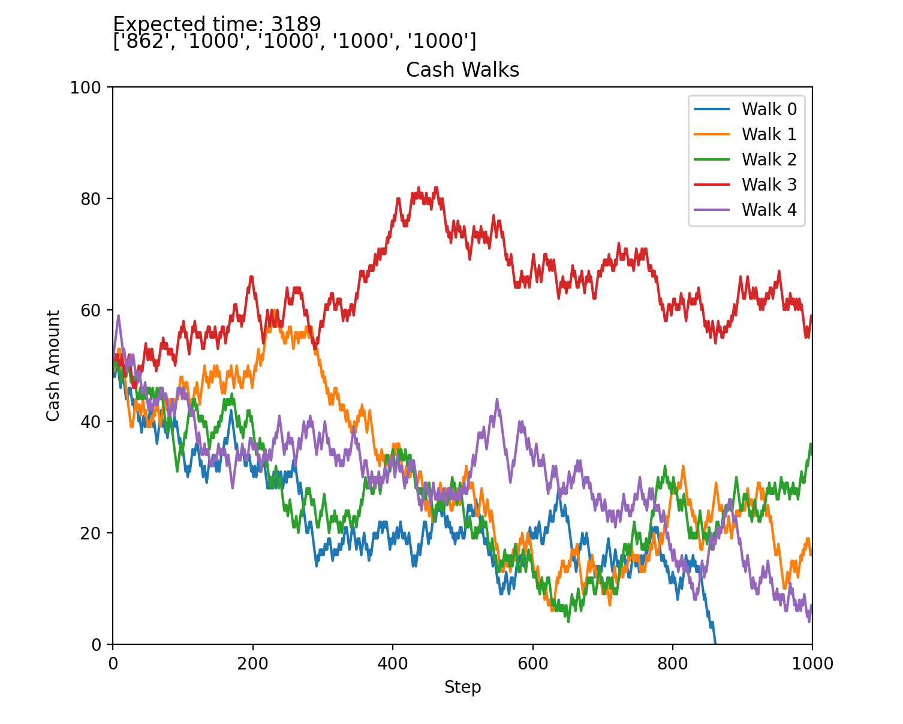

# probability-models
Simulations for Markov processes &amp; random walks

Materials from ***Applied Mathematics*** by David Logan (4th ed)

_9.4.2 Random Walks_

Problems 2 & 3

- A gambler is playing a casino game, and on each play he wins $1 with probability p = 0.46, and he loses $1 with probability q = 0.54. He starts with $50 and decides to play the game until he goes broke, or until he wins $100. What is the probability of going broke before winning $100? How long should he expect to play? What if the odds are even?

- Referring to Exercise 2, when p = 0.46, simulate three games and plot realizations on the same set of axes.

We run a simulation of the above experiment, and compute the expected time to boundary with the equation:

Here, the solution to the second order nonhomogeneous equation was useful:

The results are displayed as follows:

This small simulation was produced as a demonstration for our MAP4103 (Math Modeling) Final Project.

